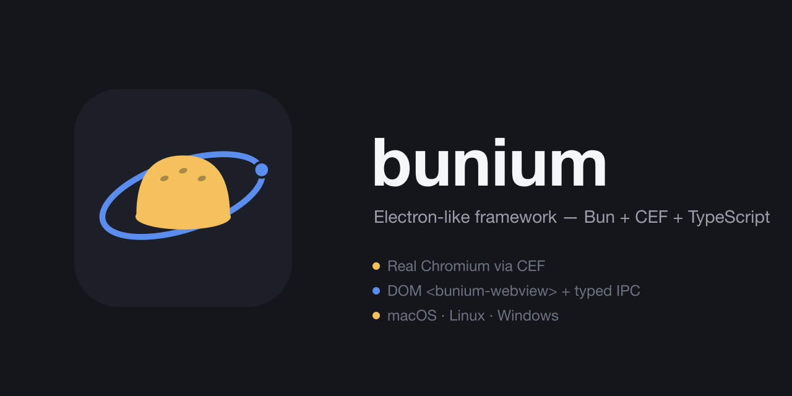

<p align="center">
  
</p>

<h1 align="center">bunium</h1>

<p align="center">
  Electron-like desktop app framework — <a href="https://bun.sh">Bun</a> (not Node) +
  <a href="https://bitbucket.org/chromiumembedded/cef">CEF</a> (not Chromium-via-Electron).
</p>

<p align="center">
  <a href="https://github.com/erfanmola/bunium/actions/workflows/ci.yml"></a>
  <a href="https://github.com/erfanmola/bunium/actions/workflows/mac-smoke.yml"></a>
  <a href="https://github.com/erfanmola/bunium/actions/workflows/linux-smoke.yml"></a>
  <a href="https://github.com/erfanmola/bunium/actions/workflows/win-smoke.yml"></a>
  <a href="LICENSE"></a>
</p>

<p align="center">
  
</p>

## What is this

bunium is a from-scratch alternative to Electron. Instead of Node + Chromium bundled
by Electron's own build, bunium runs on the **Bun** runtime and embeds **CEF** (the
Chromium Embedded Framework) directly, rendered into a native layer — not a system
WebView, not Electron's fork of Chromium. Every window is real Chromium, composited
via `bun:ffi` calls into a small C++ shim over CEF's C++ API (never hand-rolled
vtable structs — see [ARCHITECTURE.md](ARCHITECTURE.md)).

- **DOM-integrated `<bunium-webview>`** — a real custom element, not an iframe hack,
  clipped/z-ordered/hit-tested as a native sublayer.
- **Typed IPC** — one generic transport, discriminated-union message maps checked on
  both sides at compile time.
- **Vite dev, `bunium://` prod** — point `loadURL` at a Vite dev server for HMR;
  serve built output over a custom scheme in production.
- **Native system surface** — menu bar, tray, notifications, dialogs, each a thin
  typed wrapper over a flat C ABI, per platform.
- **Auto-update** — bsdiff patch-or-full-manifest updater that never re-downloads the
  CEF layer, with crash-journal self-repair.
- **macOS · Linux · Windows** — all three ports build, package, and pass smoke tests
  in CI.

## Status

Window/paint, typed IPC, `<bunium-webview>`, Vite dev + prod scheme, native system
features, packaging/codesigning, auto-update, CEF resource trim, and per-platform npm
packages are all implemented and verified on macOS, Linux, and Windows. See
[ARCHITECTURE.md](ARCHITECTURE.md) for the load-bearing technical decisions behind
each one, and [Publishing](docs/guide/publishing.md) for the release pipeline.

## Quickstart

```sh
bunx --bun create-bunium-app my-app --template=solid-ts
cd my-app
bun install
bun dev
```

Templates: `react-ts`, `react-js`, `solid-ts`, `solid-js`, `vue-ts`, `vue-js` — all
Vite-based. Full walkthrough: [Getting started](docs/guide/getting-started.md).

```ts
import { app, BuniumWindow } from "bunium";

const win = new BuniumWindow({
  url: "https://example.com",
  width: 1024,
  height: 700,
  title: "Hello",
});

win.onClose(() => app.shutdown());
```

## Docs

Full site: **[erfanmola.github.io/bunium](https://erfanmola.github.io/bunium/)**

- [Getting started](docs/guide/getting-started.md)
- [Window](docs/guide/window.md) · [Typed IPC](docs/guide/ipc.md) ·
  [`<bunium-webview>`](docs/guide/webview.md) · [System features](docs/guide/system.md)
- [Packaging](docs/guide/packaging.md) · [Auto-update](docs/guide/updates.md)
- [API reference](docs/api/index.md)

## Contributing

This is an active solo project; issues and PRs are welcome but expect the API surface
to keep moving pre-1.0. See [ARCHITECTURE.md](ARCHITECTURE.md) before touching native
code — several approaches were deliberately tried and rejected there. Building
bunium's own native layer (not needed to just use `bunium`): [Windows build
guide](docs/guide/windows.md), [Dev from macOS](docs/guide/dev-from-mac.md),
[Publishing](docs/guide/publishing.md).

## License

[MIT](LICENSE)
